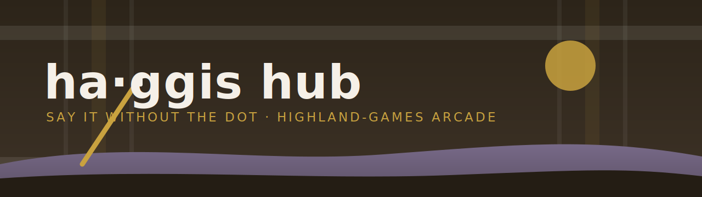

<div align="center">



# ha&middot;ggis Hub

**A playable Highland-games arcade lobby.** Walk up to a door, tap, and you are in a game.
*ha + ggis = haggis &mdash; say it without the dot.*


🎮 **Live at [ha.ggis.xyz](https://ha.ggis.xyz)**

</div>

A Rust + WebAssembly core (`hub-core`, `hub-wasm`, `hub-hardlang`) drives deterministic
movement and door proximity; a strict TypeScript/Vite host owns lifecycle, input, the game
registry, direct-play launch seams, and a hand-rolled Canvas2D renderer. Deployment is
hardened (CSP, security headers, source-map policy, build verification) and browser smoke
tests cover both the keyboard and tap launch paths.

---
## Start here

Begin with the [Documentation index](docs/README.md). It catalogues every doc and gives the full recommended reading order.

If you only have time for the load-bearing five, read these in order:

1. [Quality manifesto](docs/foundation/11-quality-manifesto.md) — why this project exists and what it refuses to be
2. [Project charter](docs/foundation/00-project-charter.md) — identity, non-negotiables, WHS boundary
3. [Stack decision record](docs/foundation/05-stack-decision-record.md) — Rust/WASM core + TypeScript host
4. [Design system](DESIGN.md) — colour, typography, grid, motion, voice, register policy (the technique spec — sister to WHS's DESIGN.md)
5. [First public release requirements](docs/foundation/07-quality-gates.md#first-public-release-requirements) — scope of the first public release

[`AGENTS.md`](AGENTS.md) is the entry point for autonomous agents. [`CONTRIBUTING.md`](CONTRIBUTING.md) is the entry point for humans contributing changes. [`SECURITY.md`](SECURITY.md) covers vulnerability reporting.

## Current state

- Product: playable haggis games lobby (single bothy room + door-to-game launch).
- Public domain shape: `ggis.xyz` redirects to `ha.ggis.xyz`.
- First linked game: Wild Haggis Survivors (launches from the right-wall door; tap/click the door, or walk + Enter/Space/E).
- Implementation status: end-to-end functional. Rust core advances the sim; WASM boundary publishes snapshots; the browser host walks the haggis, paints the bothy, fires door launches. CI is two-tier: `pnpm verify` (typecheck + lint + fmt:check + vitest + build + dist verification) runs on every PR; the full `haggis-eval all` release gate (rust + rust-cov + ts + coverage + security + perf + browser + multi-browser + determinism + visual + a11y + soak + supply-chain + differential hash/rng) runs on push to main and emits a cryptographically signed JSON report.
- Current executable stack: Rust workspace (`hub-core`, `hub-wasm`, `hub-hardlang`) + TypeScript/Vite host.
- Renderer: Canvas2D ([ADR-0005](docs/decisions/0005-canvas2d-first-room-renderer.md)). Bothy interior is Canvas2D with a painted backdrop and sprite path in `src/render/canvas-room.ts`, plus procedural fallback/fixture helpers in `src/render/bothy-haggis.ts`, `src/render/whs-bothy.ts`, and `src/render/whs-hearth.ts`.
- Hard-language commitments shipped: C FNV-1a hash + WAT xoshiro128** RNG, each diff-tested against the Rust default across 100 000+ cases ([`crates/hub-hardlang`](crates/hub-hardlang/)).

## Non-negotiable standard

Small scope is allowed. Weak foundations are not.

The first public release is a **First Perfect Slice**, not an MVP. It should be small enough to finish and strict enough to prove the final quality bar: deterministic core logic where useful, clear runtime boundaries, strict tests, secure deployment, documented decisions, and no dependency soup.

## Engineering portfolio summary

The hub is also a **portfolio artifact for the engineering layer underneath**. The visible bothy is the product; the receipts below are the craft signal that the README, the repo, and the gates collectively carry. None of these are sloganware — every claim resolves to code, a gate, or a generated report you can run yourself.

- **~92 KB total client** (55 KB JS + 28 KB WASM + 3.6 KB HTML + 5.25 KB CSS, ~34 KB gzipped) for a Rust+WASM playable hub with deterministic core, self-hosted serif font, opt-in hub music, and cryptographically signed eval reports.
- **Four hand-rolled FNV-1a 64 implementations** — Rust (`crates/hub-core/src/hash.rs`), C (`c/fnv1a.c` linked into `crates/hub-hardlang`), Go (`tools/haggis-eval/internal/fnv/`), and TypeScript (`src/engine/input-log.ts`, the `.haggislog` digest). All four agree byte-for-byte on the published reference vectors, asserted in CI — the Rust/C/Go trio diff-tested against each other, the TypeScript writer checked against the same vectors.
- **WAT xoshiro128\*\* RNG** — hand-written in WebAssembly Text at `asm/xoshiro128_starstar.wat`, compiled at test time via `wasmi`, differentially tested against the Rust default across 100 000+ cases ([craft commitments §B](docs/foundation/12-craft-commitments.md)).
- **Go orchestrator (`haggis-eval`)** — single-binary, stdlib-only CLI that runs every project gate (`rust`, `rust-cov`, `ts`, `coverage`, `security`, `perf`, `browser`, `multi-browser`, `determinism`, `visual`, `a11y`, `soak`, `supply-chain`, `differential rng`, `differential hash`, `all`) and emits a **signed JSON report**. The report's `signature` field is the FNV-1a 64 hash of its own payload, so any post-hoc edit is detectable. See [`tools/haggis-eval/README.md`](tools/haggis-eval/README.md).
- **Mozilla Observatory A+** target via `public/_headers` — full CSP, HSTS preload, X-Frame-Options DENY, Permissions-Policy denying ~30 features, COOP/CORP/Origin-Agent-Cluster. No `unsafe-eval`; `wasm-unsafe-eval` only.
- **`unsafe_code = "forbid"`** workspace-wide. Exactly one crate (`hub-hardlang`) downgrades to `deny` with a single scoped relaxation for the C FFI seam, documented at the relaxation point.
- **`clippy::pedantic`** enabled on every crate. **`tsc --strict`** + `pnpm verify` builds the dist and verifies it.
- **vitest suite** + cargo workspace tests + seven Playwright smokes on chromium (keyboard launch, touch tap, pointer-drive, music toggle, reduced-motion, locked-door, a11y) + six core smokes on Firefox and WebKit each + per-asset perf budgets + determinism smoke (same seed + scripted input → same state hash across two browser runs) + a visual gate (perceptual aHash of the canvas at a fixed seed + fixed animation phase, Hamming-distance check against a recorded golden) + a hand-rolled accessibility gate (26 WCAG 2.2 AA spot-checks via Playwright, no axe-core dep).
- **ADR-disciplined**: every architectural decision is a numbered, dated record with status, supersession links, and rationale. See [`docs/decisions/`](docs/decisions/).
- **Autopilot-ready**: explicit agent ruleset, required-reading order, doc/code drift detection in audit reports. See [`AGENTS.md`](AGENTS.md).

Code: [MIT](LICENSE). Design system: [`DESIGN.md`](DESIGN.md). All claims above are reproducible — `cd tools/haggis-eval && go build . && ./haggis-eval all` produces the signed report locally.

## Repository documentation map

- `docs/foundation/` — canonical project foundation and policies (numbered).
- `docs/architecture/` — runtime architecture, boundaries, testing, security, observability (mostly shipped; observability planned).
- `docs/decisions/` — architecture decision records (ADRs).
- `docs/plans/` — implementation plans and execution sequences.
- `docs/deployment/` — deployment and hosting documentation.
- `docs/research/` — external research notes and uncertainty logs.
- `docs/audit/` — documentation audits and drift reports.
- `docs/archive/` — superseded plans kept as provenance.
- `.hermes/` — tooling state from external planning tools, not canonical content.

## Current executable gates

Gates supported today:

```bash
# Rust workspace (deterministic core, FFI seam, WAT showcase)
cargo fmt --all -- --check
cargo test --workspace --exclude hub-wasm
cargo clippy --workspace --all-targets -- -D warnings
RUSTFLAGS="-D warnings" cargo check --workspace --target wasm32-unknown-unknown
cargo llvm-cov --workspace --exclude hub-wasm --fail-under-lines 100 --fail-under-functions 100

# TypeScript host + deploy artifact gate
pnpm install --frozen-lockfile
pnpm verify        # typecheck → lint → fmt:check → vitest → build → scripts/verify-dist.mjs
pnpm run coverage  # vitest v8 coverage (lines=100%, stmts=100%, fns=100%, branches=100%)

# Browser smokes (each builds dist + starts vite preview internally)
node scripts/run-browser-smokes.mjs    # 7 chromium smokes: door-launch + door-tap + pointer-drive + music-toggle + reduced-motion + locked-door + a11y
PLAYWRIGHT_BROWSER=firefox node scripts/run-browser-smokes.mjs  # 6 core smokes on Firefox
PLAYWRIGHT_BROWSER=webkit  node scripts/run-browser-smokes.mjs  # 6 core smokes on WebKit
node scripts/run-determinism-smoke.mjs # same ?seed= + scripted input → same state hash

# Visual gate (builds + previews + diffs against tests/golden/)
node scripts/run-visual-gate.mjs verify   # perceptual aHash diff vs golden
node scripts/run-visual-gate.mjs capture  # re-baseline after intentional art changes

# Paint-timing gate (builds + previews + W3C Paint Timing API via chromium-headless)
node scripts/run-paint-gate.mjs           # FCP/LCP/DCL/load median vs perf-budgets.json paint.max_ms

# Accessibility gate (builds + previews + hand-rolled WCAG 2.2 AA spot-checks via Playwright)
node scripts/run-a11y-gate.mjs            # 26 checks: lang, viewport, title, names, status, label-in-name, focus, contrast, font-load, page-errors

# Memory-growth soak (15s RAF loop; heap budget 5 MB)
node scripts/run-soak-gate.mjs

# Supply-chain
cargo deny check                        # license compliance + RustSec advisories + source policy
cargo machete                           # unused Rust dependencies
gitleaks detect --source . --no-banner  # secret scan across git history
osv-scanner --recursive .               # cross-ecosystem CVE scan (Cargo + npm + Go)
```

CI (`.github/workflows/ci.yml`) is two-tier: `pnpm verify` is the fast PR gate; `haggis-eval all` (every gate above + cargo workspace + differential hash/rng) is the release gate on push to main.

A Go-built orchestrator CLI bundles every gate above into one command with a signed JSON report. See [`tools/haggis-eval/README.md`](tools/haggis-eval/README.md).

## Before writing implementation code

Future contributors and agents must read:

- [Autopilot rules](docs/foundation/11-quality-manifesto.md#autopilot-rules)
- [Stack decision record](docs/foundation/05-stack-decision-record.md)
- [Quality gates](docs/foundation/07-quality-gates.md)
- [First public release requirements](docs/foundation/07-quality-gates.md#first-public-release-requirements)

Do not scaffold from the archived original plan. It is preserved only as historical input.

