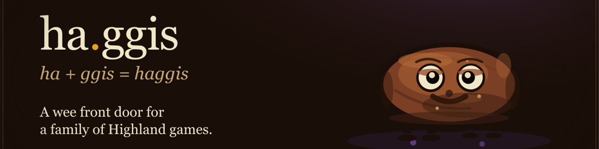
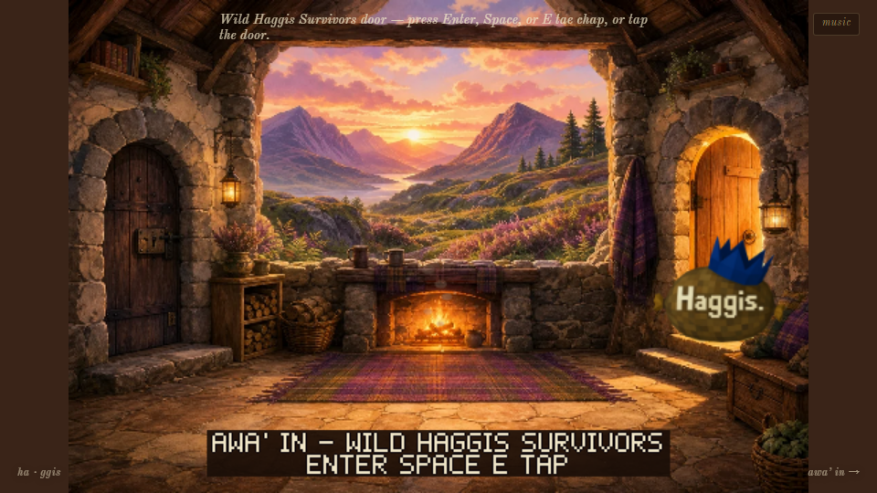
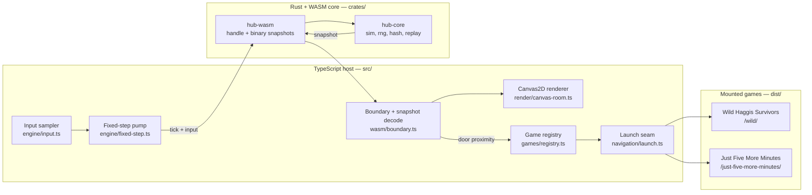

<div align="center">



# ha&middot;ggis Hub

**A playable Highland-games arcade lobby.** Walk up to a door, tap, and you are in a game.
_ha + ggis = haggis. Say it without the dot._


🎮 **Live at [ha.ggis.xyz](https://ha.ggis.xyz)**

</div>

The hub is one painted bothy room with three doors. You steer the Wee Chieftain with keys or a pointer. Reach a door and the hub offers the game behind it. One chap or tap launches it.

A Rust + WebAssembly core (`hub-core`, `hub-wasm`, `hub-hardlang`) computes deterministic movement and door proximity. A strict TypeScript/Vite host owns lifecycle, input, the game registry, launch seams, and a hand-rolled Canvas2D renderer. A full CSP, security headers, a source-map policy, and build verification harden the deployment. Browser smoke tests cover both the keyboard and the tap launch paths.

<!-- ste-lint: off -->
<table>
  <tr>
    <td width="50%"></td>
    <td width="50%"></td>
  </tr>
  <tr>
    <td align="center"><sub>The bothy, live at <a href="https://ha.ggis.xyz">ha.ggis.xyz</a></sub></td>
    <td align="center"><sub>Walk to a door and the hub offers the game</sub></td>
  </tr>
</table>
<!-- ste-lint: on -->

---

## How it works

`hub-core` is pure Rust. It advances the simulation: movement, door proximity, the RNG, FNV-1a state hashing, and input-log replay. `hub-wasm` compiles that core to WebAssembly and exposes a handle plus fixed-layout binary snapshots.

The TypeScript host samples keyboard and pointer input, pumps a fixed-step loop, and sends input across the WASM boundary. It decodes each snapshot and paints the bothy onto a Canvas2D element. Door proximity feeds the game registry. The registry builds a launch plan, and the navigator opens the mounted game route.


```mermaid
flowchart LR
  subgraph host["TypeScript host — src/"]
    input["Input sampler<br/>engine/input.ts"]
    pump["Fixed-step pump<br/>engine/fixed-step.ts"]
    codec["Boundary + snapshot decode<br/>wasm/boundary.ts"]
    render["Canvas2D renderer<br/>render/canvas-room.ts"]
    registry["Game registry<br/>games/registry.ts"]
    launch["Launch seam<br/>navigation/launch.ts"]
  end
  subgraph core["Rust + WASM core — crates/"]
    wasm["hub-wasm<br/>handle + binary snapshots"]
    sim["hub-core<br/>sim, rng, hash, replay"]
  end
  subgraph doors["Mounted games — dist/"]
    whs["Wild Haggis Survivors<br/>/wild/"]
    jfmm["Just Five More Minutes<br/>/just-five-more-minutes/"]
  end
  input --> pump
  pump -->|tick + input| wasm
  wasm --> sim
  sim -->|snapshot| wasm
  wasm --> codec
  codec --> render
  codec -->|door proximity| registry
  registry --> launch
  launch --> whs
  launch --> jfmm
```

The back-wall door stays locked. Chap it and the hub answers with a coming-soon retort. Both mounted games are separate repositories. The deploy copies their builds into `dist/` and serves them on same-origin routes.

## Run it locally

You need:

- Node 22 and pnpm 10 (see `.node-version` and the `engines` field in `package.json`)
- Rust 1.94 or later with the `wasm32-unknown-unknown` target
- `wasm-pack`

```bash
pnpm install --frozen-lockfile
pnpm run build:wasm   # compile crates/hub-wasm into src/generated/hub-wasm
pnpm exec vite        # dev server
```

For a production build and a local preview of it:

```bash
pnpm build            # WASM build + vite build + version manifest into dist/
pnpm exec vite preview
```

A hub-only build serves the bothy without the two mounted games. `pnpm run build:all` copies their builds in, but it needs sibling checkouts of both game repositories.

`pnpm test` runs the vitest suite. `cargo test --workspace` covers the Rust side. `pnpm verify` runs the full pre-merge chain.

## Engineering portfolio summary

The hub is also a portfolio artifact for the engineering layer underneath. The visible bothy is the product. The receipts below are the craft signal. Every claim resolves to code, a gate, or a generated report you can run yourself.

- **~108 KB complete client, ~41 KB gzipped.** The parts: 66.9 KB JS, 28.3 KB WASM, 8.7 KB CSS, and a 4.2 KB HTML shell. The 70.1 KB entry (index JS + CSS) stays below its 71,000-byte budget in `perf-budgets.json`, asserted by the perf gate. Recovery, diagnostics, and the procedural mascot fallback ship as failure- or mode-gated chunks. The ES2022 browser floor uses native module preloading without Vite's compatibility polyfill. The client also carries versioned settings and progress persistence, a synthesized door knock, a self-hosted serif font, and opt-in hub music.
- **Four hand-rolled FNV-1a 64 implementations**: Rust (`crates/hub-core/src/hash.rs`), C (`c/fnv1a.c`, linked into `crates/hub-hardlang`), Go (`tools/haggis-eval/internal/fnv/`), and TypeScript (`src/engine/fnv.ts`, the `.haggislog` digest). All four agree byte-for-byte on the reference vectors. CI diff-tests the Rust/C/Go trio against each other and checks the TypeScript writer against the same vectors.
- **WAT xoshiro128\*\* RNG**: hand-written in WebAssembly Text at `asm/xoshiro128_starstar.wat`. Tests compile it with `wasmi` and diff it against the Rust default across 100 000+ cases ([craft commitments §B](docs/foundation/12-craft-commitments.md)).
- **Go orchestrator (`haggis-eval`)**: a single-binary, stdlib-only CLI. It runs every project gate and emits an FNV-signed, tamper-evident JSON report. The report's `signature` field is a keyless FNV-1a 64 checksum of its own payload, so accidental or post-hoc edits are detectable. It is not a cryptographic signature. See [`tools/haggis-eval/README.md`](tools/haggis-eval/README.md).
- **Mozilla Observatory A+ target** via [`public/_headers`](public/_headers): full CSP, HSTS preload, X-Frame-Options DENY, COOP/CORP/Origin-Agent-Cluster, and a Permissions-Policy that denies 23 browser features outright. No `unsafe-eval`. `wasm-unsafe-eval` only.
- **`unsafe_code = "forbid"` workspace-wide.** Exactly one crate (`hub-hardlang`) downgrades to `deny`, with a single scoped relaxation for the C FFI seam. A comment documents the relaxation at the point of use.
- **`clippy::pedantic` on every crate**, run with `-D warnings` in CI. **`tsc --strict`** plus `pnpm verify` builds the dist and verifies it.
- **Test matrix**: vitest with 100% line, statement, function, and branch thresholds. Cargo workspace tests with 100% line and function coverage enforced. Nine Playwright smokes on chromium and eight core smokes each on Firefox and WebKit. Determinism smokes: the same seed plus scripted input yields the same state hash across two browser runs. A browser-captured `.haggislog` replays through WASM `replay_run` to the same live hash. A dual-signal visual gate diffs whole-room and protagonist-detail aHashes at a fixed seed. A hand-rolled accessibility gate runs 38 WCAG 2.2 AA spot-checks via Playwright, with no axe-core dependency. A memory soak and supply-chain scans complete the set.
- **ADR-disciplined**: every architectural decision is a numbered, dated record with status, supersession links, and rationale. See [`docs/decisions/`](docs/decisions/).
- **Autopilot-ready**: explicit agent ruleset, required-reading order, and doc/code drift detection in audit reports. See [`AGENTS.md`](AGENTS.md).

Code: [MIT](LICENSE). Design system: [`DESIGN.md`](DESIGN.md). Deep dive: [`WRITEUP.md`](WRITEUP.md). All claims above are reproducible: `cd tools/haggis-eval && go build . && ./haggis-eval all` produces the FNV-signed report locally.

## Start here

Begin with the [Documentation index](docs/README.md). It catalogues every doc and gives the full recommended reading order.

If you only have time for the load-bearing five, read these in order:

1. [Quality manifesto](docs/foundation/11-quality-manifesto.md): why this project exists and what it refuses to be
2. [Project charter](docs/foundation/00-project-charter.md): identity, non-negotiables, WHS boundary
3. [Stack decision record](docs/foundation/05-stack-decision-record.md): Rust/WASM core + TypeScript host
4. [Design system](DESIGN.md): colour, typography, grid, motion, voice, register policy (the technique spec, sister to WHS's DESIGN.md)
5. [First public release requirements](docs/foundation/07-quality-gates.md#first-public-release-requirements): scope of the first public release

[`AGENTS.md`](AGENTS.md) is the entry point for autonomous agents. [`CONTRIBUTING.md`](CONTRIBUTING.md) is the entry point for humans contributing changes. [`SECURITY.md`](SECURITY.md) covers vulnerability reporting.

## Current state

- Product: a playable haggis games lobby. One bothy room, door-to-game launches.
- Public domain shape: `ggis.xyz` redirects to `ha.ggis.xyz`.
- Build provenance: each build writes `dist/__version`, served at `https://ha.ggis.xyz/__version`. It records hub git state plus WHS and JFMM source and build provenance.
- Playable doors: Wild Haggis Survivors launches from the right-wall door at `/wild/`. Just Five More Minutes launches from the left-wall door at `/just-five-more-minutes/`. The back-wall future-bothy door stays locked and answers chaps with coming-soon retorts.
- Implementation status: end-to-end functional. The Rust core advances the sim. The WASM boundary publishes snapshots. The browser host walks the haggis, paints the bothy, and fires door launches.
- CI is two-tier. `pnpm verify` (docs-claim drift check + typecheck + lint + fmt:check + vitest + build + dist verification) runs on every PR. The full `haggis-eval all` release gate runs on push to main and emits an FNV-signed tamper-evident JSON report (keyless FNV-1a, not cryptographic signing).
- Hub-owned settings persistence: `ggis_hub_settings` stores versioned, FNV-digested music preferences without touching WHS keys. Corrupt or unavailable browser storage falls back to defaults.
- Renderer: Canvas2D ([ADR-0005](docs/decisions/0005-canvas2d-first-room-renderer.md)). The bothy combines a painted backdrop with a hand-painted, foot-anchored Wee Chieftain sprite in `src/render/canvas-room.ts`. Deterministic procedural fallbacks and fixtures live in `src/render/bothy-haggis.ts`, `src/render/whs-bothy.ts`, and `src/render/whs-hearth.ts`.
- Hard-language commitments shipped: C FNV-1a hash plus WAT xoshiro128\*\* RNG, each diff-tested against the Rust default across 100 000+ cases ([`crates/hub-hardlang`](crates/hub-hardlang/)).

## Non-negotiable standard

Small scope is fine. Weak foundations are not.

The first public release is a **First Perfect Slice**, not an MVP. It should be small enough to finish and strict enough to prove the final quality bar. That bar: deterministic core logic where useful, clear runtime boundaries, strict tests, secure deployment, documented decisions, and no dependency soup.

## Repository documentation map

- `docs/foundation/`: canonical project foundation and policies (numbered).
- `docs/architecture/`: runtime architecture, boundaries, testing, security, observability, and debugging posture.
- `docs/decisions/`: architecture decision records (ADRs).
- `docs/plans/`: implementation plans and execution sequences.
- `docs/deployment/`: deployment and hosting documentation.
- `docs/research/`: external research notes and uncertainty logs.
- `docs/audit/`: documentation audits and drift reports.
- `docs/archive/`: superseded plans kept as provenance.
- `.hermes/`: tooling state from external planning tools, not canonical content.

## Current executable gates

Gates supported today:

```bash
# Rust workspace (deterministic core, FFI seam, WAT showcase)
cargo fmt --all -- --check
cargo test --workspace                  # whole workspace, hub-wasm boundary included
cargo clippy --workspace --all-targets -- -D warnings
RUSTFLAGS="-D warnings" cargo check --workspace --target wasm32-unknown-unknown
cargo llvm-cov --workspace --fail-under-lines 100 --fail-under-functions 100

# TypeScript host + deploy artifact gate
node scripts/check-doc-claims.mjs
pnpm install --frozen-lockfile
pnpm verify        # docs:claims → typecheck → lint → fmt:check → vitest → build → scripts/verify-dist.mjs
pnpm run production:check  # opt-in live probe: ha.ggis.xyz, ggis.xyz redirect, /wild/, /just-five-more-minutes/, /__version
pnpm run coverage  # vitest v8 coverage (lines=100%, stmts=100%, fns=100%, branches=100%)

# Browser smokes (each builds dist + starts vite preview internally)
node scripts/run-browser-smokes.mjs    # 9 chromium smokes: 8 core + a11y
PLAYWRIGHT_BROWSER=firefox node scripts/run-browser-smokes.mjs  # 8 core smokes on Firefox
PLAYWRIGHT_BROWSER=webkit  node scripts/run-browser-smokes.mjs  # 8 core smokes on WebKit
node scripts/run-determinism-smoke.mjs # same ?seed= + scripted input → same state hash, plus browser .haggislog → replay_run hash match

# Visual gate (builds + previews + diffs against tests/golden/)
node scripts/run-visual-gate.mjs verify   # whole-room + protagonist-detail aHash diff
node scripts/run-visual-gate.mjs capture  # re-baseline after intentional art changes

# Paint-timing gate (builds + previews + W3C Paint Timing API via chromium-headless)
node scripts/run-paint-gate.mjs           # FCP/LCP/DCL/load median vs perf-budgets.json paint.max_ms

# Accessibility gate (builds + previews + hand-rolled WCAG 2.2 AA spot-checks via Playwright)
node scripts/run-a11y-gate.mjs            # 38 checks: lang, viewport, title, names, disclosure, recovery, status, reflow, targets, focus, contrast, font-load, page-errors

# Memory-growth soak (15s RAF loop; heap budget 5 MB)
node scripts/run-soak-gate.mjs

# Supply-chain
cargo deny check                        # broad licence policy + RustSec advisories + source policy
cargo machete                           # unused Rust dependencies
gitleaks detect --source . --no-banner  # secret scan across git history
osv-scanner --recursive .               # cross-ecosystem CVE scan (Cargo + npm + Go)
```

CI (`.github/workflows/ci.yml`) is two-tier. `pnpm verify` is the fast PR gate. `haggis-eval all` (every gate above + cargo workspace + differential hash/rng) is the release gate on push to main.

A Go-built orchestrator CLI bundles every gate above into one command with an FNV-signed tamper-evident JSON report. See [`tools/haggis-eval/README.md`](tools/haggis-eval/README.md).

## Before writing implementation code

Future contributors and agents must read:

- [Autopilot rules](docs/foundation/11-quality-manifesto.md#autopilot-rules)
- [Stack decision record](docs/foundation/05-stack-decision-record.md)
- [Quality gates](docs/foundation/07-quality-gates.md)
- [First public release requirements](docs/foundation/07-quality-gates.md#first-public-release-requirements)

Do not scaffold from the archived original plan. It survives only as historical input.
